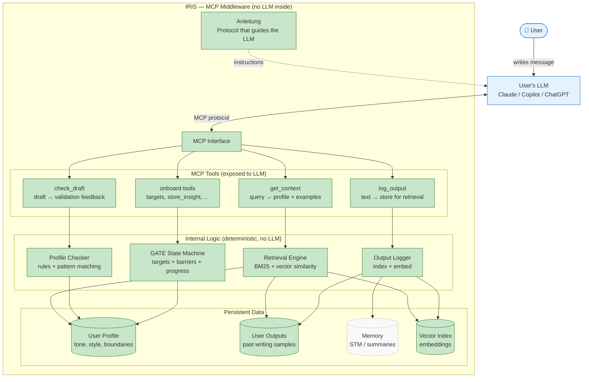
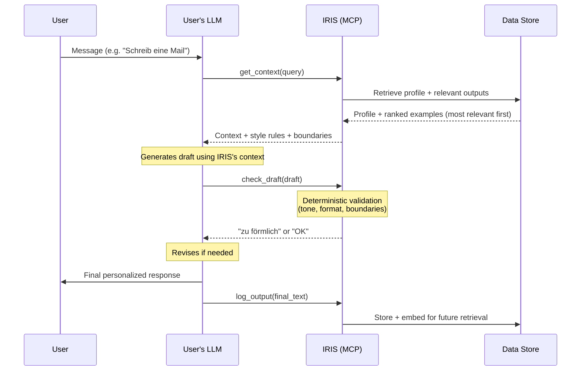
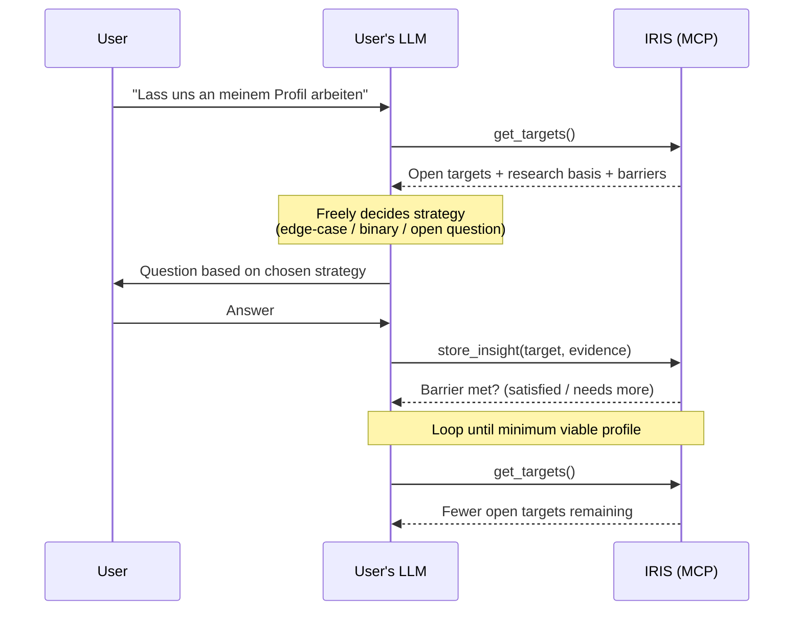
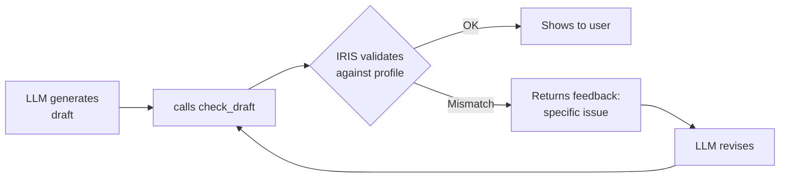
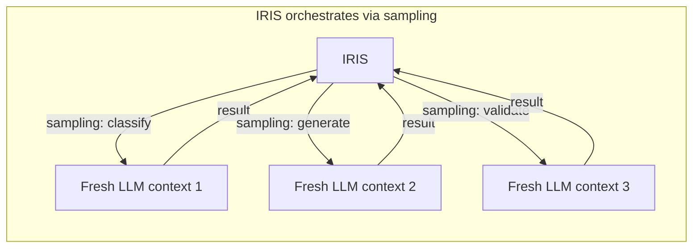
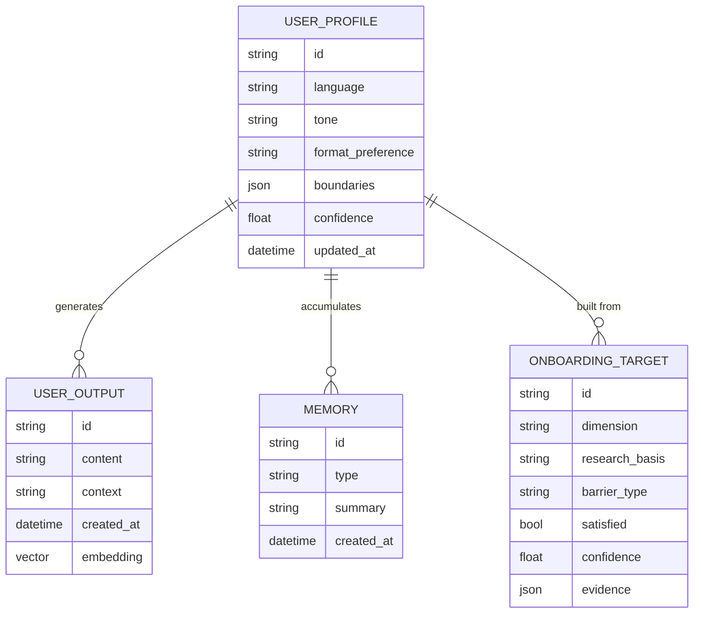

# IRIS — Architecture

## System Architecture (with Build Status)

### Legend

| Color | Meaning |
|-------|---------|
| 🟢 Green | Built and working |
| 🟡 Yellow | Current segment (building now) |
| ⚪ Gray | Planned (not yet implemented) |
| 🔵 Blue | External system (user's LLM) |

---

## Interaction Flow

---

## Onboarding Flow (GATE)

> IRIS defines WHAT to learn (research-backed targets with barriers).
> The LLM decides HOW to ask (strategy, order, phrasing).

---

## The Self-Check Pattern

> **Why this works:** The LLM thinks `check_draft` is an external service.
> IRIS validates with fresh eyes — profile rules only, no generation context.
> Result: unbiased feedback the LLM couldn't give itself.

---

## Layer 2: MCP Sampling (Advanced Clients Only)

> Each step = isolated context (no bleed between roles).
> Same user LLM, but IRIS controls the orchestration.
> Falls back to Layer 1 (tools + Anleitung) for basic clients.

---

## Data Model

---

## Segment Progress

```mermaid
graph LR
    S0[✓ Skeleton<br>+ Hooks]
    S1[✓ MCP<br>Server]
    S2[✓ Data<br>Layer]
    S3[Retrieval]
    S4[Validation]
    S5[Onboarding]
    S6[Anleitung]
    S7[Sampling]
    S8[Learning]
    S9[Production]

    S0 --> S1 --> S2 --> S3 --> S4 --> S5 --> S6 --> S7 --> S8 --> S9

    style S0 fill:#C8E6C9,stroke:#2E7D32
    style S1 fill:#C8E6C9,stroke:#2E7D32
    style S2 fill:#C8E6C9,stroke:#2E7D32
    style S3 fill:#FFF9C4,stroke:#F57F17
    style S4 fill:#f5f5f5,stroke:#bbb
    style S5 fill:#f5f5f5,stroke:#bbb
    style S6 fill:#f5f5f5,stroke:#bbb
    style S7 fill:#f5f5f5,stroke:#bbb
    style S8 fill:#f5f5f5,stroke:#bbb
    style S9 fill:#f5f5f5,stroke:#bbb
```

---

## Design Decisions

| Decision | Why |
|----------|-----|
| IRIS never generates, only validates | User's LLM generates; IRIS provides context + validation |
| Two-stage validation | Deterministic (free, fast) → MCP sampling (semantic, unbiased) |
| MCP sampling for validation | Use user's LLM in fresh context (no generation bias) |
| Adaptive validation strategy | Try MCP sampling → fallback deterministic only (no forced dependencies) |
| `check_draft` as blind validator | LLM can't judge its own work; fresh context check is unbiased |
| Research-based targets | Every onboarding dimension must cite evidence (GATE, Wu et al.) |
| Two layers | Layer 1 works with any MCP client; Layer 2 uses sampling for validation |
| User outputs > inputs | Wu 2024: past writing drives personalization, not past questions |
| Most-relevant-first | Wu 2024: position in context matters — best examples go first |
| Tools split over time | Start broad, refine into granular tools as patterns emerge |

---

*This document updates after each segment (progress tracker hook). Components turn green as they are built.*
