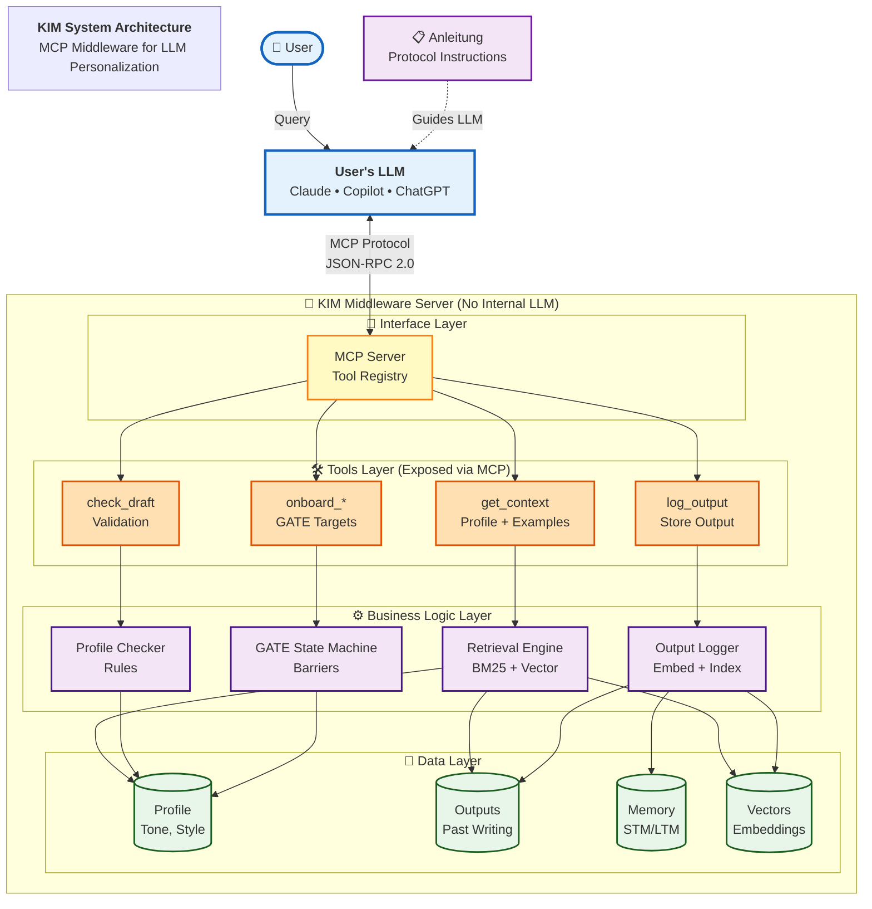
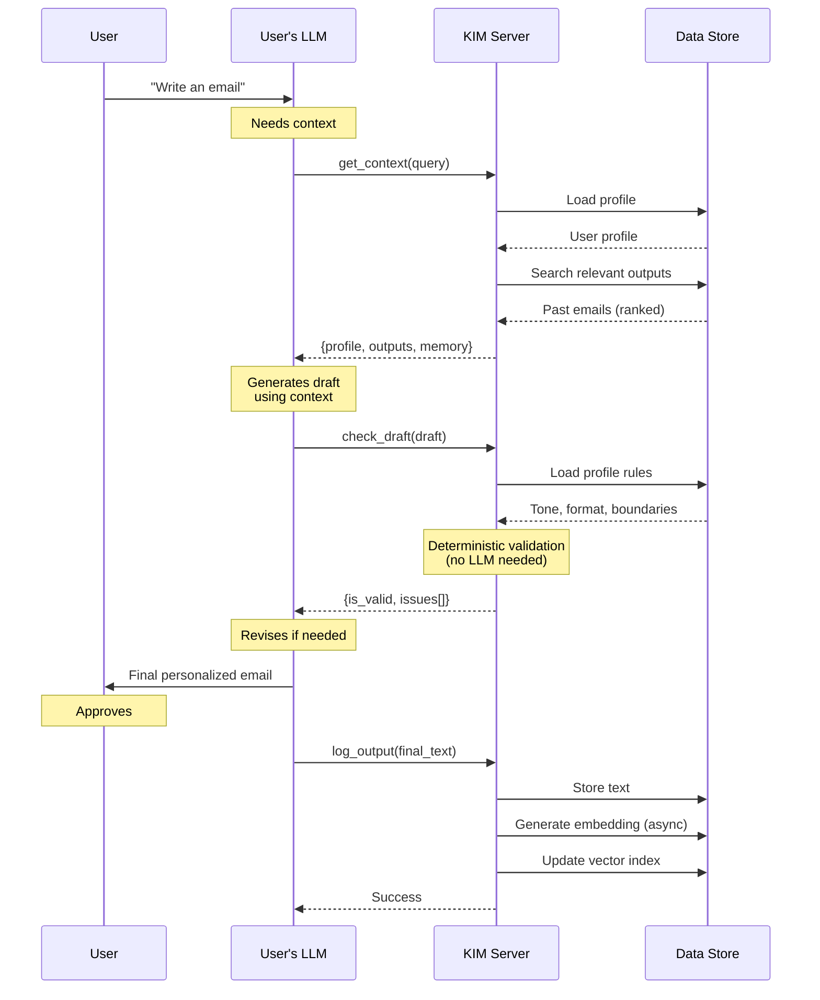
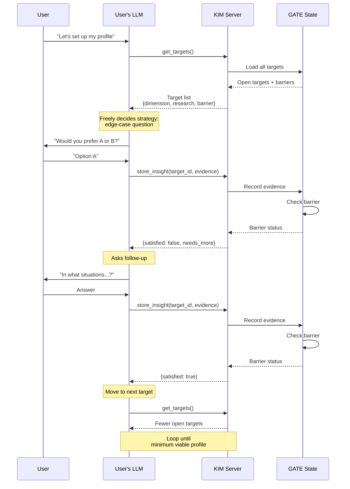
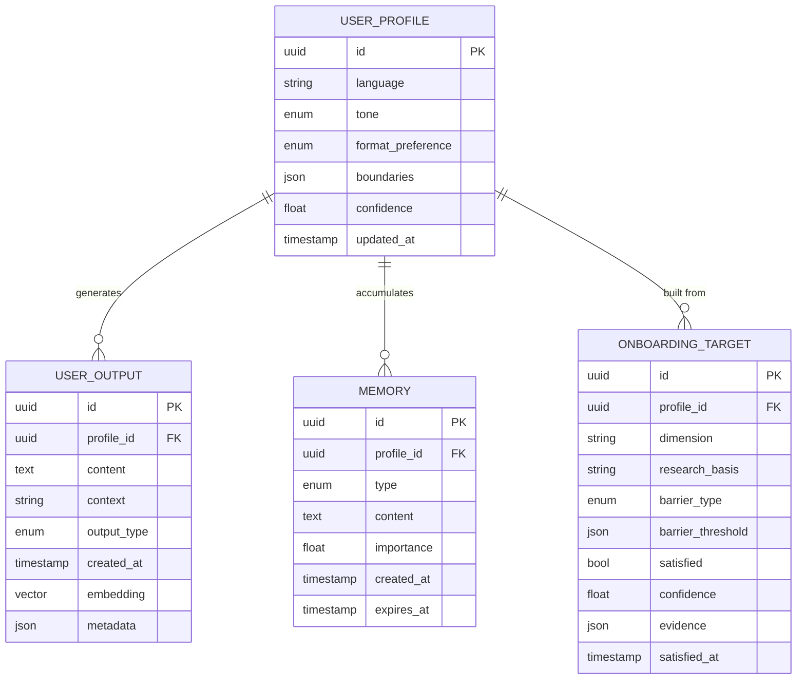
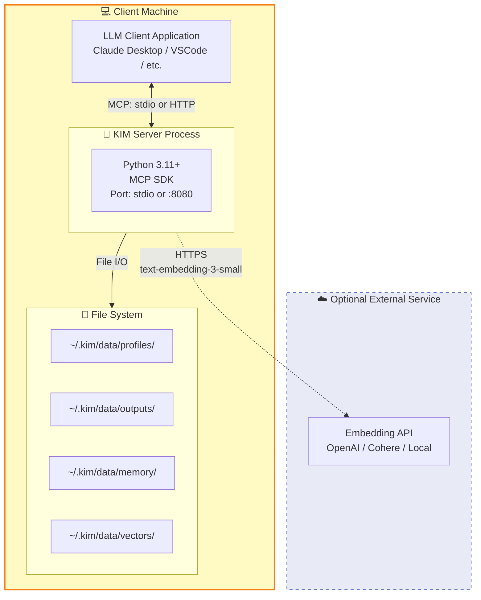

# KIM System Architecture — Professional Diagram

**Version:** 1.0  
**Date:** 2026-08-25  
**Status:** Segment 0 Complete

---

## System Overview

---

## Interaction Flow

---

## Onboarding Flow (GATE)

---

## Data Model

---

## Deployment Architecture

---

## Key Characteristics

| Characteristic | Description |
|----------------|-------------|
| **🌐 LLM-Agnostic** | Works with any MCP-capable LLM (Claude, Copilot, ChatGPT) |
| **⚡ Zero Compute** | No internal LLM required — pure logic + data |
| **📚 Research-Backed** | Based on GATE (ICLR 2025), Wu et al. (2024) |
| **💾 Portable** | File-based storage, no database required |
| **🔒 Privacy-First** | All data stays local, no cloud transmission |
| **✅ Deterministic** | Validation is rule-based, no LLM needed |

---

## Technology Stack

| Layer | Technology | Rationale |
|-------|-----------|-----------|
| Protocol | Python MCP SDK | Official SDK, well-documented |
| Runtime | Python 3.11+ | Async support, type hints |
| Package Manager | uv | Fast, modern, deterministic |
| Data Models | Pydantic v2 | Validation, serialization |
| Vector Search | ChromaDB / FAISS | Embedded, no external service |
| Embeddings | OpenAI API / sentence-transformers | Flexible (cloud or local) |
| Storage | File system (JSON) | Simple, portable |
| Testing | pytest + pytest-asyncio | Industry standard |

---

## Research Foundations

### GATE (Li et al., ICLR 2025)
- LLM-driven preference elicitation via edge-cases
- Forced choices reveal tacit knowledge
- 5-10 minute optimal window
- Works with open-source models

### User Profile Roles (Wu et al., 2024)
- User **outputs** (not inputs) drive personalization
- Output-only format fits 2-5x more in context
- Most-relevant-first ordering critical
- Non-user content hurts performance

### Multi-Agent Personalization (Westhaeusser et al., 2025)
- Coordinator → Operator → Validator → Generator
- Multi-tiered memory (STM/LTM)
- 96% retrieval accuracy with full system

---

## Build Status

```mermaid
graph LR
    S0[✅ Segment 0<br/>Skeleton]
    S1[⏳ Segment 1<br/>MCP Server]
    S2[📋 Segment 2<br/>Data Layer]
    S3[📋 Segment 3<br/>Retrieval]
    S4[📋 Segment 4<br/>Validation]
    S5[📋 Segment 5<br/>Onboarding]
    S6[📋 Segment 6<br/>Anleitung]
    S7[📋 Segment 7<br/>Sampling]
    S8[📋 Segment 8<br/>Learning]
    S9[📋 Segment 9<br/>Production]
    
    S0 --> S1 --> S2 --> S3 --> S4 --> S5 --> S6 --> S7 --> S8 --> S9
    
    style S0 fill:#C8E6C9,stroke:#2E7D32,stroke-width:3px
    style S1 fill:#FFF9C4,stroke:#F57F17,stroke-width:3px
    style S2 fill:#f5f5f5,stroke:#bbb
    style S3 fill:#f5f5f5,stroke:#bbb
    style S4 fill:#f5f5f5,stroke:#bbb
    style S5 fill:#f5f5f5,stroke:#bbb
    style S6 fill:#f5f5f5,stroke:#bbb
    style S7 fill:#f5f5f5,stroke:#bbb
    style S8 fill:#f5f5f5,stroke:#bbb
    style S9 fill:#f5f5f5,stroke:#bbb
```

---

**Legend:**
- ✅ Complete
- ⏳ In Progress
- 📋 Planned

---

**Document Version:** 1.0  
**Last Updated:** 2026-08-25  
**Format:** Mermaid (renders in VS Code, GitHub, compatible tools)
